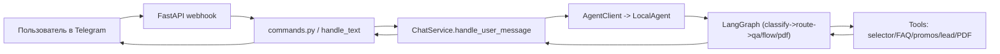
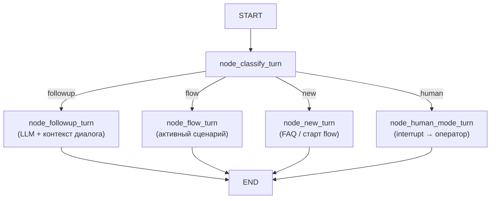
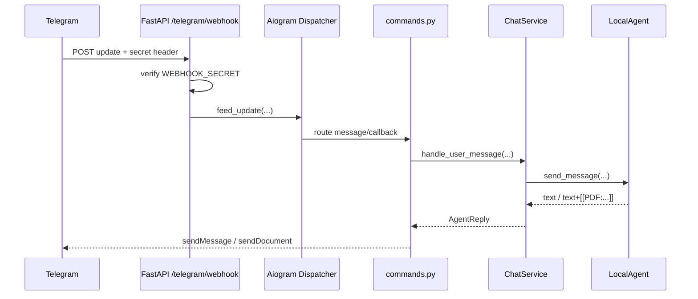
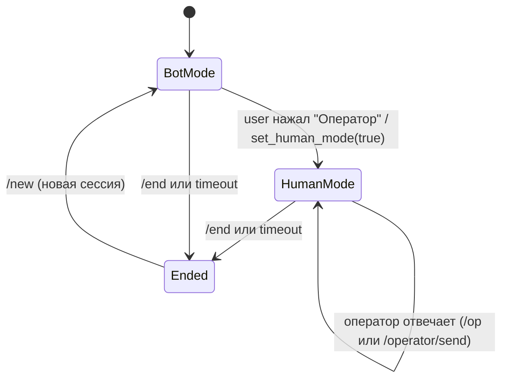

# Complex Agent API

Telegram-бот банка на `aiogram` + `FastAPI` с локальным `LangGraph`-агентом, хранением истории в БД, подбором кредитных продуктов, PDF-графиком платежей и гибридным режимом (бот + оператор).

## 1) Состав проекта

- Telegram runtime и обработчики: `main.py`, `app/bot/*`
- Локальный агент (интенты, сценарии, FAQ, подбор, PDF): `app/services/local_agent.py`
- Сервис чата и сессий: `app/services/chat_service.py`
- FastAPI (webhook + operator API): `app/api/fastapi_app.py`
- БД модели и сессии: `app/db/*`
- Скрипты импорта/сидирования: `scripts/*`

## 2) Быстрый запуск

```bash
python3 -m venv .venv
source .venv/bin/activate
pip install -r requirements.txt
cp .env.example .env
alembic upgrade head
python3 main.py
```

## 3) Переменные окружения

Минимальные:

- `BOT_TOKEN`
- `DATABASE_URL` (пример: `sqlite+aiosqlite:///./bot.db`)
- `OPENAI_API_KEY`

Ключевые для webhook:

- `WEBHOOK_BASE_URL` (обязателен для реального webhook, должен быть HTTPS)
- `WEBHOOK_PATH` (по умолчанию `/telegram/webhook`)
- `WEBHOOK_SECRET` (секрет проверки заголовка от Telegram)

Остальные важные:

- `OPERATOR_IDS` (список Telegram ID операторов через запятую)
- `OPERATOR_API_KEY` (ключ для `POST /operator/send`)
- `LANGGRAPH_CHECKPOINT_BACKEND` (`auto|sqlite|postgres|memory`)
- `LANGGRAPH_CHECKPOINT_URL`
- `LANGGRAPH_DIALOG_TTL_MINUTES`
- `LANGGRAPH_TTL_STORE_PATH`
- `SESSION_INACTIVITY_TIMEOUT_MINUTES` (автозакрытие неактивной сессии, по умолчанию `60`, можно ставить большие значения, например месяц = `43200`)
- `HUMAN_MODE_OPERATOR_TIMEOUT_MINUTES` (автовозврат из human-mode в bot-mode, если оператор не ответил после переключения, по умолчанию `10`)

См. пример: `.env.example`.

## 4) Архитектура агента

Код: `app/services/local_agent.py`

### 4.1 Общая схема



### 4.2 Граф состояний (LangGraph)



Узлы:

- `node_classify_turn`: определяет маршрут (`followup` / `flow` / `new` / `human`).
- `node_followup_turn`: короткие уточняющие follow-up фразы — ответ через LLM с историей диалога.
- `node_flow_turn`: шаги активного сценария подбора продукта (ипотека, авто, депозит и т.д.).
- `node_new_turn`: новый запрос — сначала FAQ, затем старт подходящего сценария.
- `node_human_mode_turn`: вызывает `interrupt()` и ждёт ответа оператора через `Command(resume=...)`.

**BotState:**
```python
class BotState(TypedDict, total=False):
    messages: List[Any]       # история сообщений (auto-trim до MAX_DIALOG_MESSAGES)
    last_user_text: str       # текущее сообщение пользователя
    answer: str               # ответ агента
    dialog: Dict[str, Any]    # {flow, step, slots} — состояние сценария
    human_mode: bool          # True → направить в node_human_mode_turn
    _route: str               # внутренний: результат классификации
```

### 4.3 Интенты и формы

Текущие интенты:

- `greeting`, `faq`, `general_products`, `credit_overview`, `deposit`, `consumer_credit`,
  `auto_loan`, `mortgage`, `microloan`, `debit_card`, `fx_card`, `transfer`, `mobile_app`, `unknown`

Формы сценариев задаются в:

- `MORTGAGE_FLOW_QUESTIONS`
- `AUTO_LOAN_FLOW_QUESTIONS`
- `MICROLOAN_FLOW_QUESTIONS`
- `EDUCATION_FLOW_QUESTIONS`
- агрегатор `FLOW_QUESTION_BLOCKS`

Нормализация полей:

- LLM extraction: `_llm_parse_flow_fields(...)`
- fallback-парсеры (если LLM не извлек): `_fallback_extract_field_value(...)`
- типы полей и enum-значения: `LLM_FIELD_SPECS`

### 4.4 Источники данных

- FAQ из таблицы `faq` (`FaqItem`).
- Продуктовый справочник: `app/data/ai_chat_info.json` (манифест) + `app/data/ai_chat_info/*.json` (секции).
- Для подбора используются инструменты:
  - `mortgage_selector`
  - `auto_loan_selector`
  - `microloan_selector`
  - `education_selector`

### 4.5 Память, Checkpointing и TTL

**Short-term (per-session):** LangGraph Checkpointer хранит `BotState` между сообщениями в рамках одной сессии.

Бэкенд выбирается через `LANGGRAPH_CHECKPOINT_BACKEND`:

| Значение | Поведение |
|----------|-----------|
| `auto` (по умолчанию) | SQLite (`LANGGRAPH_CHECKPOINT_URL` или `.langgraph_checkpoints.sqlite3`) |
| `sqlite` | SQLite по пути из `LANGGRAPH_CHECKPOINT_URL` |
| `postgres` | PostgreSQL — нужно задать `LANGGRAPH_CHECKPOINT_URL` |
| `memory` | In-memory (теряется при рестарте, только для dev) |

Инициализация происходит в `LocalAgent.setup()` при старте сервера (lifespan).

**Long-term (cross-session):** `InMemoryStore` хранит предпочтения пользователя между сессиями (язык, последний интерес). Подходит для dev; для production замените на `PostgresStore`.

**Обрезка истории:** последние `MAX_DIALOG_MESSAGES` сообщений (по умолчанию 50, настраивается через env).

### 4.6 Lead и PDF

- После финализации flow создается demo lead через tool `create_lead`.
- Для ипотека/авто/микро доступны варианты PDF-графика платежей.
- В ответ встраивается маркер `[[PDF:/path/to/file.pdf]]`, а бот отправляет файл как документ.

## 5) Как добавить новую услугу или новый сценарий

Ниже рабочий чеклист для нового сценария, например `consumer_loan`.

### 5.1 Минимальный путь (только QA, без отдельного flow)

Если новая услуга не требует пошагового опроса:

1. Добавьте ключевые слова услуги в эвристики QA (при необходимости).
2. Добавьте/обновите данные в FAQ и/или `ai_chat_info`.
3. При необходимости добавьте отдельный tool по аналогии с `get_active_promos`.
4. Проверьте ответ в `bank_kb_search`.

### 5.2 Полный путь (новый flow сценарий)

1. Добавьте интент.

- Обновите `Intent = Literal[...]` новым значением.
- Обновите системный prompt в `node_classify_intent` (описание нового интента).
- Добавьте эвристику в `_parse_credit_category(...)` (если применимо).

2. Опишите анкету flow.

- Создайте `NEW_FLOW_QUESTIONS` (required + question).
- Подключите в `FLOW_QUESTION_BLOCKS`.
- Добавьте human-friendly пояснения в `QUESTION_EXPLANATIONS` (опционально, но желательно).

3. Опишите типы полей.

- Расширьте `LLM_FIELD_SPECS` для новых ключей.
- Для устойчивости добавьте fallback в `_parse_enum_field_value(...)` и/или другие парсеры.

4. Реализуйте бизнес-подбор.

- Создайте функции:
  - `_select_new_flow_offers(profile)`
  - `_format_new_flow_result(result)`
  - `_collect_quote_options(...)` при необходимости reuse.
- Добавьте `@tool def new_flow_selector(...)`.

5. Включите сценарий в финализацию.

- Добавьте ветку в `_finalize_reply_for_flow(...)`.
- При необходимости обновите `_default_annual_rate_from_ai_chat(...)`.
- Если нужен PDF, убедитесь, что итог возвращает `quote`/`quote_options`.

6. Включите маршрутизацию.

- Убедитесь, что `node_route(...)` может отправить интент в `start_flow`.
- Добавьте новый flow в `node_start_flow(...)` (если есть whitelist-проверки).
- Добавьте summary отображение в `_profile_summary_text(...)`.

7. Обновите данные.

- Если услуга завязана на продуктовый справочник, добавьте новый section JSON.
- При необходимости обновите `scripts/export_ai_chat_info_json.py`.

8. Проверьте end-to-end.

```bash
python3 -m py_compile app/services/local_agent.py app/services/chat_service.py app/bot/handlers/commands.py app/api/fastapi_app.py
```

Ручной smoke test:

- `/new`
- запрос на новую услугу
- пройти все шаги анкеты
- проверить итоговый подбор и (если нужно) PDF

### 5.3 Важные места, которые чаще всего забывают

- Синонимы пользовательских ответов для enum (`любая`, `без разницы`, разговорные формы).
- Ветка с уточняющими вопросами (`_is_clarification_question`), чтобы не ломался шаг flow.
- Ограничение Telegram по длине сообщения (используйте безопасную отправку длинных текстов).

## 6) Telegram Webhook: как работает подробно

Код: `main.py` + `app/api/fastapi_app.py`

### 6.1 Последовательность запуска

1. `python3 main.py` запускает `uvicorn` с `app.api.fastapi_app:app`.
2. В `lifespan(...)` создаются `Bot`, `Dispatcher`, `ChatService`, `AgentClient`.
3. Регистрируются middleware и роуты aiogram.
4. Если задан `WEBHOOK_BASE_URL`, вызывается `bot.set_webhook(...)`:
   - URL = `WEBHOOK_BASE_URL + WEBHOOK_PATH`
   - secret = `WEBHOOK_SECRET` (если указан)
   - `drop_pending_updates=True`

### 6.2 Обработка каждого webhook-update



### 6.3 Безопасность webhook

- Рекомендуется всегда задавать `WEBHOOK_SECRET`.
- Endpoint сверяет `X-Telegram-Bot-Api-Secret-Token`.
- При несовпадении вернет `403`.

### 6.4 Локальная разработка webhook

1. Поднимите сервис:

```bash
python3 main.py
```

2. Поднимите туннель:

```bash
ngrok http 8001
```

3. Установите в `.env`:

```env
WEBHOOK_BASE_URL=https://<ngrok-domain>
WEBHOOK_PATH=/telegram/webhook
WEBHOOK_SECRET=<random-secret>
```

4. Перезапустите сервис.

5. Проверка:

```bash
curl http://127.0.0.1:8001/health
curl "https://api.telegram.org/bot<BOT_TOKEN>/getWebhookInfo"
```

### 6.5 Что может пойти не так

- `WEBHOOK_BASE_URL` пустой: webhook не регистрируется.
- URL не HTTPS: Telegram не доставляет update.
- Неверный `WEBHOOK_SECRET`: 403.
- Слишком длинный текст: `TelegramBadRequest: message is too long` (нужно чанковать ответ).
- Сессии закрываются слишком рано: увеличьте `SESSION_INACTIVITY_TIMEOUT_MINUTES`.

## 7) Гибридный режим (бот + оператор)

Код: `app/services/chat_service.py`, `app/bot/handlers/commands.py`, `app/api/fastapi_app.py`

### 7.1 Идея режима

- По умолчанию с пользователем общается бот (LocalAgent).
- Пользователь может нажать кнопку подключения оператора.
- После включения `human_mode=true` сообщения пользователя не идут в агента, а ждут ответа оператора.

### 7.2 Какие поля отвечают за режим

Таблица `chat_sessions`:

- `human_mode` (bool)
- `human_mode_since` (datetime)
- `assigned_operator_id` (telegram id оператора)
- `status` (`active|ended`)

Сообщения пишутся в таблицу `messages` с `role`:

- `user`
- `agent`
- `operator`
- `system`

### 7.3 Переходы состояний



### 7.4 Каналы ответа оператора

1. В Telegram:

- `/op_sessions` — список активных human-сессий.
- `/op <session_id> <текст>` — отправка ответа пользователю.

2. Через API:

- `POST /operator/send`
- Включает `human_mode=true` для сессии (если ещё не включен).

### 7.5 Как это выглядит в обработке сообщений

1. Пользователь пишет сообщение.
2. `ChatService.handle_user_message(...)` сохраняет входящее сообщение.
3. Если `human_mode=true`, метод сразу возвращает текст “сообщение передано оператору” и не вызывает агента.
4. Если `human_mode=false`, запрос уходит в `LocalAgent`.
5. Ответ сохраняется и отправляется пользователю.

### 7.6 Возврат из human mode

- Пользователь может вручную нажать inline-кнопку `🤖 Вернуться к боту` в активной сессии.
- Если после перехода в human-mode оператор не ответил в течение `HUMAN_MODE_OPERATOR_TIMEOUT_MINUTES`, система автоматически вернет сессию в bot-mode и уведомит пользователя.
- Если оператор ответил в этом окне, автопереключение не срабатывает.

### 7.7 Переключение между активными сессиями

- У пользователя может быть несколько активных сессий.
- В `🗂️ Мои сессии` бот показывает:
  - полный `ID` сессии;
  - короткий код вида `<alias>-<номер>` (например `Khasanboy-2`).
- Чтобы продолжить конкретную активную сессию:
  - `сессия 2`
  - `сессия <ID>`
  - `<alias>-2`
- Кнопка `📞 Колл-центр` (или текст `новая сессия`) создает новую активную сессию и не закрывает остальные.

## 8) API endpoints

### 8.1 `GET /health`

- Проверка, что приложение поднято.

### 8.2 `POST {WEBHOOK_PATH}`

- Endpoint для Telegram webhook.
- Проверяет секрет (если задан).
- Десериализует `Update` и передает в aiogram dispatcher.

### 8.3 `POST /operator/send`

Назначение:

- отправить сообщение пользователю от оператора;
- сохранить его в историю;
- включить `human_mode` для сессии.

Пример:

```bash
curl -X POST http://127.0.0.1:8001/operator/send \
  -H "Content-Type: application/json" \
  -H "X-API-Key: YOUR_API_KEY" \
  -d '{
    "session_id":"SESSION_ID",
    "text":"Здравствуйте, я оператор",
    "operator_name":"Ali",
    "operator_id":123456
  }'
```

Коды:

- `200` — OK
- `401` — неверный API key
- `404` — сессия не найдена
- `409` — сессия закрыта
- `502` — ошибка отправки в Telegram API

## 9) Полезные скрипты

### 9.1 Полный цикл заполнения базы (после первого запуска)

```bash
# 1. Экспортировать xlsx → JSON (нужен "AI CHAT INFO.xlsx")
python3 scripts/export_ai_chat_info_json.py "<path-to-AI CHAT INFO.xlsx>"

# 2. Заполнить кредитные продукты (ипотека, автокредит, микрозайм, образовательный)
python3 scripts/seed_credit_product_offers.py --replace

# 3. Заполнить некредитные продукты (вклады + карты одной командой)
python3 scripts/seed_noncredit_product_offers.py --replace

# 4. Импортировать FAQ из xlsx
python3 scripts/import_faq_xlsx.py "scripts/FAQ.xlsx" --replace

# 5. Заполнить отделения (тестовые данные — замените реальными или скипните)
python3 scripts/seed_branches.py --replace
```

### 9.2 Описание каждого скрипта

| Скрипт | Назначение |
|--------|-----------|
| `export_ai_chat_info_json.py` | Парсит "AI CHAT INFO.xlsx" (листы кредитных и некредитных продуктов) → JSON-файлы в `app/data/ai_chat_info/` + манифест `app/data/ai_chat_info.json`. Запускать при изменении xlsx. |
| `seed_credit_product_offers.py` | Сид таблицы `credit_product_offers` из манифеста. Поддерживает: Ипотека, Автокредит, Микрозайм, Образовательный. Парсит ставки по типам дохода (зарплатный / официальный / неофициальный). |
| `seed_deposit_product_offers.py` | Сид таблицы `deposit_product_offers` из манифеста. Разбирает вклады по валютам (UZS/USD/EUR), ставки, сроки, условия пополнения и выплаты. |
| `seed_card_product_offers.py` | Сид таблицы `card_product_offers` из манифеста. Разбирает карты: сеть (Visa/Mastercard/Uzcard/Humo), валюта, кэшбэк, стоимость выпуска, способы заказа. |
| `seed_noncredit_product_offers.py` | Удобная обёртка: запускает `seed_deposit_product_offers` + `seed_card_product_offers` за один вызов. |
| `import_faq_xlsx.py` | Импортирует FAQ (вопрос–ответ) из xlsx в таблицу `faq`. Поддерживает многоязычность (ru/en/uz). Флаги: `--replace`, `--dry-run`, `--limit N`. |
| `seed_branches.py` | Сид тестовых отделений банка (Ташкент + регионы). Содержит **демо-данные** — замените реальными перед продакшеном. |

### 9.3 Отдельный запуск вкладов / карт

```bash
# Только вклады
python3 scripts/seed_deposit_product_offers.py --replace

# Только карты
python3 scripts/seed_card_product_offers.py --replace
```

## 10) Миграции

```bash
alembic upgrade head
alembic revision -m "comment" --autogenerate
```

## 11) Проверка после изменений

```bash
python3 -m py_compile app/bot/handlers/commands.py app/services/local_agent.py app/services/chat_service.py app/api/fastapi_app.py
```

## 12) Тесты

```bash
pip install pytest
python3 -m pytest tests/ -v
```

Покрытые области (`tests/test_local_agent.py`):
- `_normalize_text`, `_is_question_like`, `_is_conversational_followup`
- `_classify_new_intent_rules`, `_find_last_human_and_ai`
- `_extract_amount_sum`, `_extract_term_months`
- `_default_dialog`, `_clear_flow`, `_set_flow`

## 13) Новые переменные окружения

| Переменная | По умолчанию | Описание |
|-----------|--------------|----------|
| `LANGGRAPH_CHECKPOINT_BACKEND` | `auto` | `auto\|sqlite\|postgres\|memory` |
| `LANGGRAPH_CHECKPOINT_URL` | `.langgraph_checkpoints.sqlite3` | Путь к SQLite или postgres DSN |
| `MAX_DIALOG_MESSAGES` | `50` | Максимум сообщений в памяти на сессию |
| `LOCAL_AGENT_INTENT_LLM_ENABLED` | `1` | Включить LLM-классификацию интентов |
| `LOCAL_AGENT_INTENT_LLM_MODEL` | `gpt-4o-mini` | Модель для классификации и follow-up ответов |
| `LOCAL_AGENT_INTENT_LLM_MIN_CONFIDENCE` | `0.62` | Минимальный порог уверенности LLM |

## 14) Архитектурные улучшения (changelog)

### v2 (текущая версия)

- **Multi-node LangGraph граф**: вместо одного узла теперь 5 специализированных узлов с явным conditional routing
- **Async checkpointing**: `LocalAgent.setup()` инициализирует `AsyncSqliteSaver` / `AsyncPostgresSaver` на основе конфига; `graph.ainvoke()` вместо `asyncio.to_thread`
- **Human-mode через `interrupt()`**: `node_human_mode_turn` вызывает `langgraph.types.interrupt()`, граф приостанавливается и возобновляется через `Command(resume=operator_reply)`
- **Conversational follow-up**: Gate 1 в `node_classify_turn` ловит фразы типа "точно доступно?" и "а что потом сделать" — ответ через LLM с историей диалога
- **Long-term memory**: `InMemoryStore` хранит язык и предпочтения пользователя между сессиями
- **Typing indicator**: `ChatAction.TYPING` отправляется пока агент думает
- **Trim истории**: история автоматически обрезается до `MAX_DIALOG_MESSAGES`
- **Unit tests**: 36 тестов для ключевых helper-функций
