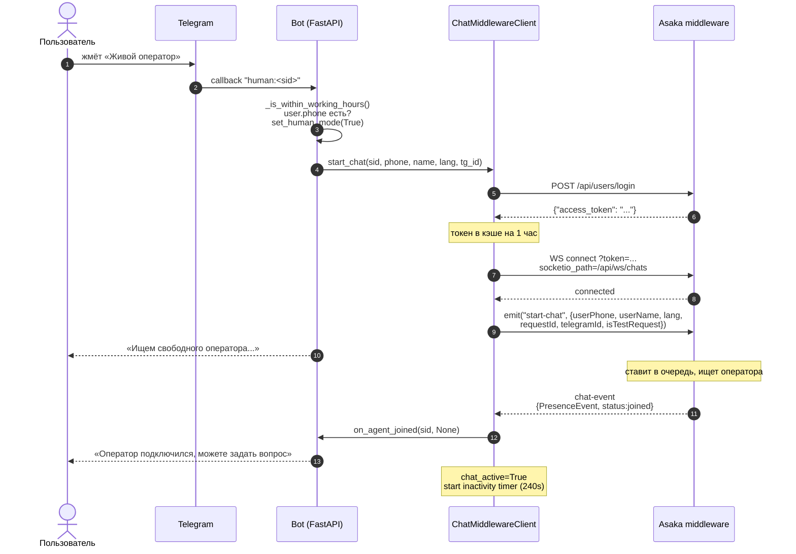
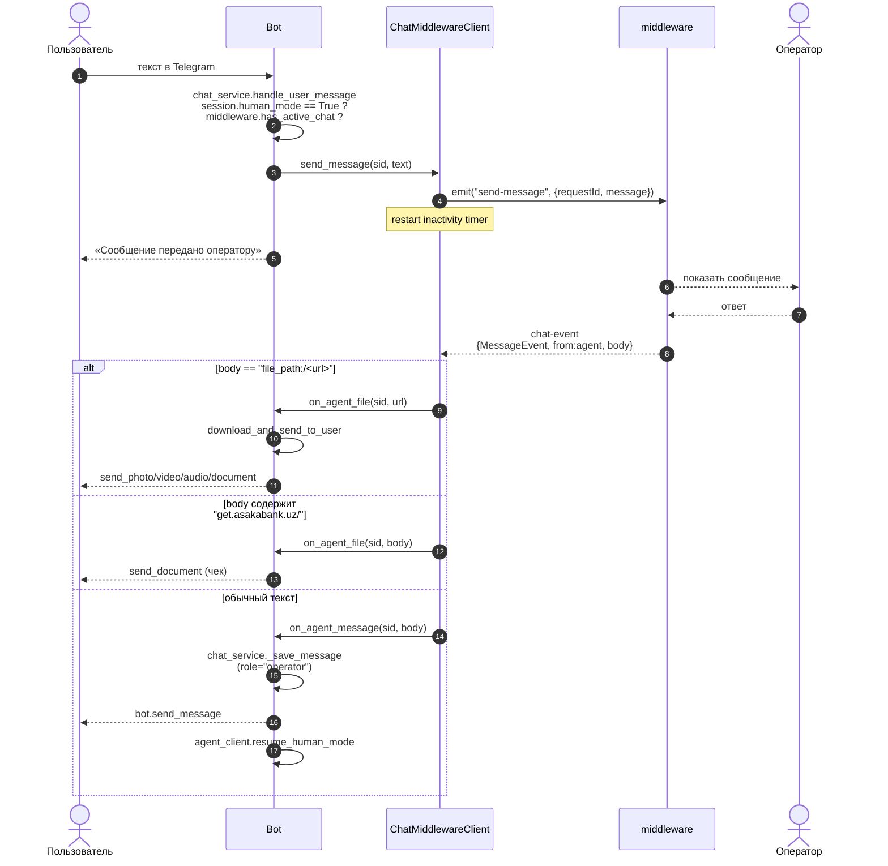
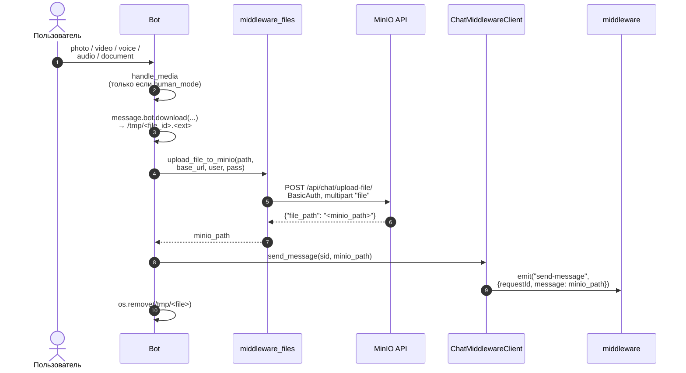
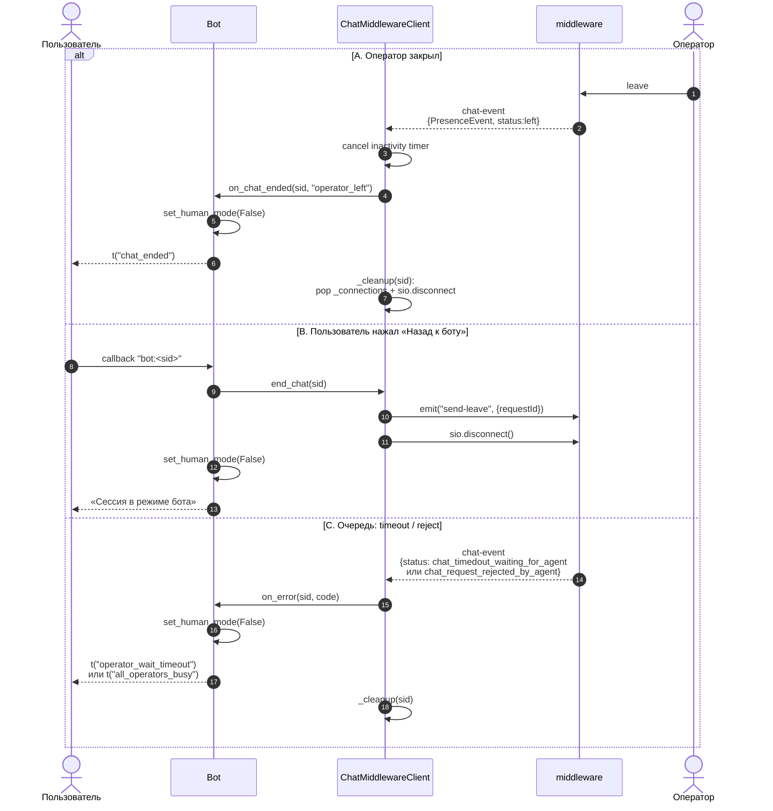
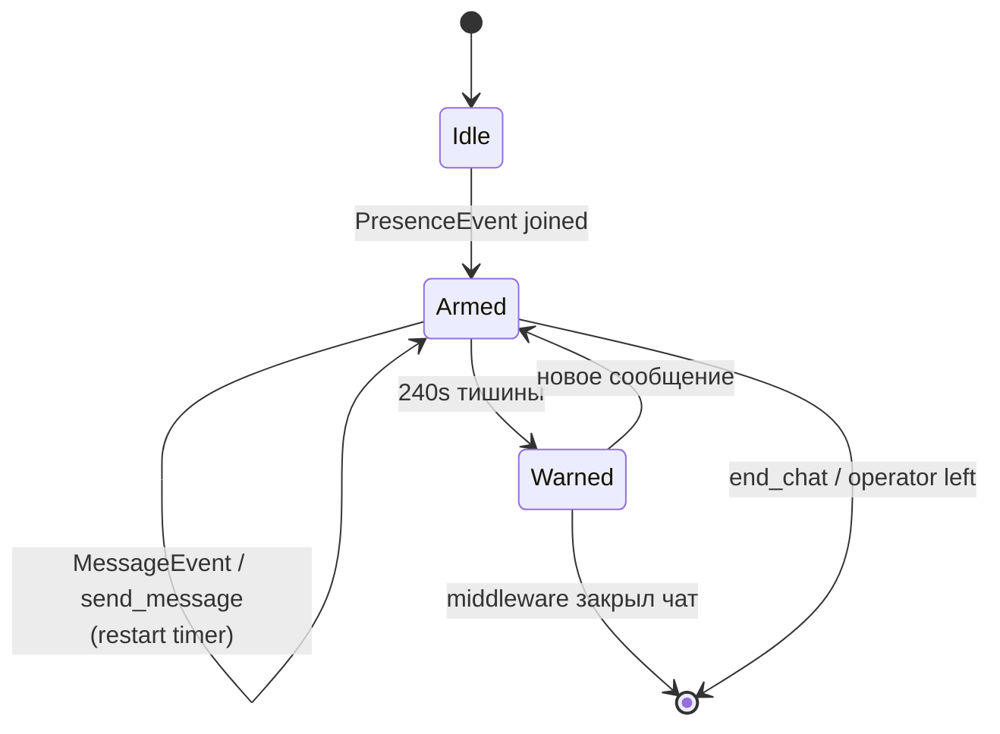
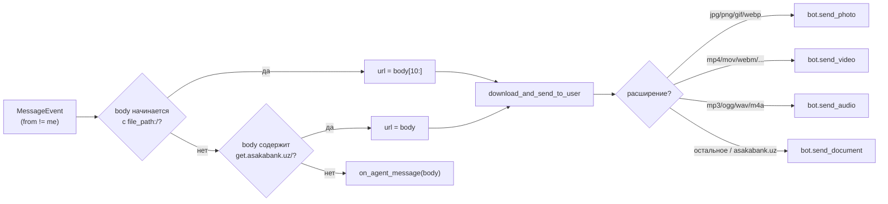

# Интеграция Bot ↔ Asaka Chat Middleware

Документация описывает интеграцию Telegram-бота с **Asaka chat-middleware**
для передачи диалогов живым операторам.

Реализация совместима 1:1 с эталонным `call_center_bot/services/chat.py`
(этот код используется в проде Asaka и принят как «истина в последней
инстанции» по протоколу).

---

## TL;DR

- Транспорт: **Socket.IO** поверх HTTPS, JWT в query-string.
- Один `ChatMiddlewareClient` на приложение, держит
  `dict[session_id → ChatConnection]`.
- Активируется флагом `MIDDLEWARE_ENABLED=true` + кредами.
- Подключается **в момент** нажатия «Живой оператор», а не на старте.
- Файлы пользователя → MinIO (`POST /api/chat/upload-file/`) → ссылка
  пересылается оператору как обычное сообщение.
- Файлы оператора (`file_path:/...`, `get.asakabank.uz/...`) → бот сам
  скачивает и шлёт пользователю адекватным методом aiogram
  (photo/video/audio/document).
- Inactivity warning через 240 сек, working hours 8–23 Asia/Tashkent
  (оба настраиваются через env).

---

## Совместимость с `call_center_bot` — построчно

Все пункты протокола совпадают с
`call_center_bot/services/chat.py` и `call_center_bot/helpers/`.

| # | Что | call_center_bot | У нас | OK |
|---|---|---|---|---|
| 1 | Auth-запрос | `POST {url}/api/users/login` body `{login,password}` → `access_token` | то же | OK |
| 2 | Кэш JWT | `asyncio.Lock`, TTL=3600s, fallback на просроченный | то же | OK |
| 3 | URL Socket.IO | `{host}/api/ws/chats?token={jwt}` | то же | OK |
| 4 | `socketio_path` | `/api/ws/chats` (без trailing `/`) | то же | OK |
| 5 | `transports` | `["websocket"]` | то же | OK |
| 6 | TLS | `verify_ssl=False` | то же (env `MIDDLEWARE_VERIFY_SSL`) | OK |
| 7 | Reconnection | `reconnection=False` | то же | OK |
| 8 | Connect timeout | `asyncio.wait_for(..., timeout=30)` | то же | OK |
| 9 | `start-chat` | `{userPhone, userName, lang, requestId, telegramId, isTestRequest}` | то же | OK |
| 10 | `send-message` | `{requestId, message}` | то же | OK |
| 11 | `send-leave` | `{requestId}` | то же | OK |
| 12 | Канал событий | `chat-event` с `eventData.{type,status,from,body}` | то же | OK |
| 13 | `MessageEvent` (`from!="me"`) | текст в `body` | то же | OK |
| 14 | Префикс `file_path:/` | `body[10:]` как файл | то же | OK |
| 15 | Подстрока `get.asakabank.uz/` | `body` как документ (чек) | то же | OK |
| 16 | `PresenceEvent joined` | оператор подключился | то же | OK |
| 17 | `PresenceEvent left` | оператор отключился | то же | OK |
| 18 | `StatusEvent chat_finished_error` | завершение с ошибкой | то же | OK |
| 19 | `start-error` | ошибка старта | то же | OK |
| 20 | `chat_timedout_waiting_for_agent` | таймаут ожидания | то же | OK |
| 21 | `chat_request_rejected_by_agent` | оператор отклонил | то же | OK |
| 22 | Inactivity warning | `asyncio.Task`, 240 сек, перезапуск на каждом MessageEvent | то же (per-session) | OK |
| 23 | MinIO upload | `POST {BASE_URL}/api/chat/upload-file/`, BasicAuth, multipart `file` | то же | OK |
| 24 | Файлы в Telegram | `send_photo/video/audio/document` по расширению | то же | OK |
| 25 | Working hours | 8–23 Asia/Tashkent | то же (env-настройки) | OK |

Архитектурное отличие (намеренное): у нас один общий
`ChatMiddlewareClient` на приложение, а в `call_center_bot` сокет
прибит к FSM пользователя. Наш дизайн централизованный, лучше
переживает рестарт и не ломается, если у пользователя нет FSM-state.

---

## Архитектура

```mermaid
flowchart TD
    ENV[".env"] --> CFG["app/config.py<br/>Settings"]
    CFG --> APP["app/api/fastapi_app.py<br/>lifespan создаёт<br/>bot · dp · chat_service<br/>agent_client<br/>middleware_client + 6 callbacks"]
    CFG --> CMD["app/bot/handlers/commands.py<br/>enable_human_mode<br/>disable_human_mode<br/>handle_media"]

    APP --> CLIENT["app/services/<br/>chat_middleware_client.py<br/>get_token (cache 1h, lock)<br/>start_chat → sio.connect+emit<br/>send_message · end_chat<br/>on chat-event handler<br/>inactivity timer 240s"]
    CMD --> CLIENT
    CMD --> FILES["app/services/<br/>middleware_files.py<br/>upload_file_to_minio<br/>download_and_send_to_user"]
    CLIENT --> FILES

    CLIENT -.Socket.IO.-> MW[("Asaka<br/>chat-middleware")]
    FILES -.HTTPS.-> MW
```

---

## Протокол

### 1. JWT auth

```
POST {MIDDLEWARE_URL}/api/users/login
Content-Type: application/json
{
  "login":    "<MIDDLEWARE_LOGIN>",
  "password": "<MIDDLEWARE_PASSWORD>"
}

200 OK
{
  "access_token": "eyJhbG..."
}
```

Токен кэшируется на 1 час под `asyncio.Lock`. Если попытка обновления
проваливается, а в кэше есть просроченный — он используется как
fallback.

### 2. Socket.IO connect

```python
socket_url = f"{ws_url}/api/ws/chats?token={jwt}"

sio = socketio.AsyncClient(
    http_session=aiohttp.ClientSession(
        connector=aiohttp.TCPConnector(verify_ssl=False)
    ),
    reconnection=False,
)

await asyncio.wait_for(
    sio.connect(
        socket_url,
        transports=["websocket"],
        socketio_path="/api/ws/chats",
    ),
    timeout=30,
)
```

Особенности, без которых middleware отвергает подключение:
- JWT в **query-string** `?token=...`, не в `auth=`
- `socketio_path` **без** trailing slash
- `transports=["websocket"]` (без long-polling)

### 3. emit `start-chat`

```python
await sio.emit("start-chat", {
    "userPhone":     phone,            # = requestId
    "userName":      user_name,
    "lang":          lang,             # 'ru' | 'en' | 'uz'
    "requestId":     phone,
    "telegramId":    str(telegram_id),
    "isTestRequest": True,             # из env MIDDLEWARE_IS_TEST_REQUEST
})
```

`requestId` = телефон пользователя — обязательный ключ во ВСЕХ
последующих emit'ах.

### 4. emit `send-message` / `send-leave`

```python
await sio.emit("send-message", {"requestId": phone, "message": text})
await sio.emit("send-leave",   {"requestId": phone})
```

### 5. Получение событий: канал `chat-event`

Все события приходят в едином канале. Структура payload:

```python
event = {
  "eventData": {
    "type":   "...",   # MessageEvent | PresenceEvent | StatusEvent | start-error
    "status": "...",   # joined | left | chat_finished_error | chat_timedout_waiting_for_agent | ...
    "from":   "...",   # me | agent
    "body":   "...",   # текст или ссылка
    "detail": "..."
  }
}
```

| `type` | `status` | Что значит | Колбэк у нас |
|---|---|---|---|
| `MessageEvent` | — | сообщение от оператора (если `from != "me"`) | `on_agent_message` или `on_agent_file` |
| `PresenceEvent` | `joined` | оператор подключился | `on_agent_joined` |
| `PresenceEvent` | `left` | оператор отключился | `on_chat_ended("operator_left")` |
| `StatusEvent` | `chat_finished_error` | системная ошибка завершения | `on_chat_ended("chat_finished_error")` |
| `start-error` | — | ошибка при старте | `on_error("start_error")` |
| (любой) | `chat_timedout_waiting_for_agent` | очередь, никто не взял | `on_error(status)` |
| (любой) | `chat_request_rejected_by_agent` | оператор отклонил | `on_error(status)` |

Распознавание файлов в `MessageEvent.body`:

```
body == "file_path:/<url>"        -> on_agent_file(<url>)
body содержит "get.asakabank.uz/" -> on_agent_file(body)   # чек, отправить как document
иначе                              -> on_agent_message(body)
```

---

## Sequence: запрос оператора



## Sequence: переписка



## Sequence: медиа от пользователя



## Sequence: завершение



---

## Inactivity warning

Per-session `asyncio.Task` со `sleep(240)`. Таймер
**сбрасывается** при каждом:

- `MessageEvent` от оператора
- `PresenceEvent joined`
- успешном `send-message` от пользователя

Если 240 секунд тишины — вызывается колбэк `on_inactivity_warning(sid)`,
который шлёт пользователю `t("chat_inactivity_warning", lang)` —
«Чат закроется через минуту из-за бездействия».

Сам факт тайм-аута чата по бездействию решает middleware (240 сек —
это лишь предупреждение, не закрытие).



---

## Working hours

По умолчанию выключено. Включается флагом
`MIDDLEWARE_WORKING_HOURS_ENABLED=true`. Окно — `[start, end)` в часах
часового пояса с указанным offset'ом. Дефолт: `8..23` Asia/Tashkent (UTC+5).

Если пользователь жмёт «Живой оператор» вне окна — бот отвечает
`t("working_hours", lang)` и не подключается к middleware.

---

## Файлы

### От пользователя оператору

См. [Sequence: медиа от пользователя](#sequence-медиа-от-пользователя).
Поддерживаются `photo/video/audio/voice/document`. Если у бота
не настроен MinIO — при попытке отправить медиа в human_mode пользователь
получает `t("message_send_failed", lang)`.

### От оператора пользователю

Middleware шлёт URL через `MessageEvent.body` в одной из двух форм:

```
file_path:/https://example.com/path/to/file.jpg
https://get.asakabank.uz/.../cheque.pdf
```

Обе формы детектятся в `_register_handlers` и роутятся в
`on_agent_file`. Реальная логика — в
`app/services/middleware_files.py:download_and_send_to_user`:

1. `aiohttp.ClientSession().get(url)` → стримом во временный
   `/tmp/operator_file_<rand>.<ext>`
2. По расширению/Content-Type выбирается метод aiogram:
   - `.jpg/.png/.gif/.webp` → `bot.send_photo`
   - `.mp4/.avi/.mov/.mkv/.webm` → `bot.send_video`
   - `.mp3/.ogg/.wav/.m4a` → `bot.send_audio`
   - всё остальное и любые `get.asakabank.uz/*` (чеки) → `bot.send_document`
3. Временный файл удаляется в `finally`.



---

## Env-переменные

```dotenv
# Включение
MIDDLEWARE_ENABLED=true

# Auth
MIDDLEWARE_URL=https://chat-middleware-test-tm.asakabank.uz
MIDDLEWARE_LOGIN=telegram
MIDDLEWARE_PASSWORD=<пароль>

# isTestRequest в payload start-chat
MIDDLEWARE_IS_TEST_REQUEST=true

# TLS verify (false — для самоподписанных)
MIDDLEWARE_VERIFY_SSL=false

# Опционально: WS через nginx reverse proxy
# MIDDLEWARE_NGINX_WS_URL=https://nginx.example.com

# Working hours (опционально)
MIDDLEWARE_WORKING_HOURS_ENABLED=false
MIDDLEWARE_WORKING_HOURS_START=8
MIDDLEWARE_WORKING_HOURS_END=23
MIDDLEWARE_WORKING_HOURS_TZ_OFFSET=5

# MinIO для пересылки медиа от пользователя оператору
# (POST {MINIO_BASE_URL}/api/chat/upload-file/, BasicAuth)
MINIO_BASE_URL=http://127.0.0.1:8000
MINIO_USERNAME=chat_owner
MINIO_PASSWORD=<пароль>
```

Все читаются в `app/config.py:get_settings()`.

---

## Изменённые файлы

| Файл | Что |
|---|---|
| `app/services/chat_middleware_client.py` | Socket.IO клиент по протоколу `call_center_bot` |
| `app/services/middleware_files.py` | MinIO upload + download-and-send |
| `app/api/fastapi_app.py` | Инициализация клиента + 6 колбэков (`on_agent_message`, `on_agent_joined`, `on_chat_ended`, `on_error`, `on_agent_file`, `on_inactivity_warning`) |
| `app/bot/handlers/commands.py` | `enable_human_mode`: working hours + phone + новый payload `start_chat`. **Новый `handle_media`** для пересылки медиа в human_mode |
| `app/services/chat_service.py` | `handle_user_message` при `human_mode=True` пересылает текст через `middleware.send_message(...)` |
| `app/bot/i18n.py` | Ключи: `operator_connected`, `chat_ended`, `chat_ended_try_again`, `chat_inactivity_warning`, `working_hours`, `phone_required_for_operator`, `message_send_failed`, `connection_lost` |
| `app/config.py` | Удалён `MIDDLEWARE_CSQ`. Добавлены `MIDDLEWARE_IS_TEST_REQUEST`, `MIDDLEWARE_VERIFY_SSL`, `MIDDLEWARE_WORKING_HOURS_*`, `MINIO_*` |
| `requirements.txt` | `+aiohttp`, `+aiofiles` |
| `.env.example` | Полностью переписан блок middleware + новые секции working-hours и MinIO |

---

## Чек-лист запуска

1. Запустить Postgres (через docker-compose или brew). Без БД фоновый
   `_inactivity_watcher` будет ругаться `Connection refused` — это не
   связано с middleware.
2. `pip install -r requirements.txt` (нужны свежие `aiohttp`,
   `aiofiles`, `python-socketio[asyncio_client]`).
3. `alembic upgrade head` — на свежей БД.
4. Заполнить `.env`:
   - `MIDDLEWARE_ENABLED=true`
   - `MIDDLEWARE_URL`, `MIDDLEWARE_LOGIN`, `MIDDLEWARE_PASSWORD`
   - `MIDDLEWARE_IS_TEST_REQUEST=true` для тестового стенда
   - `MIDDLEWARE_VERIFY_SSL=false` (если самоподпись)
   - `MINIO_BASE_URL`, `MINIO_USERNAME`, `MINIO_PASSWORD`
5. `python3 main.py` — в логах должно появиться:
   `Chat Middleware client initialized (url=...)`
6. В Telegram-боте: `/start` → выбрать язык → поделиться телефоном
   (нужен для `userPhone`/`requestId`) → нажать «Живой оператор».
7. Ожидаемые сообщения от бота:
   - «Ищем свободного оператора...»
   - «Оператор подключился, можете задать свой вопрос.»
8. Когда оператор ответит — текст придёт пользователю, файлы
   (если оператор пришлёт `file_path:/...` или `get.asakabank.uz/...`)
   тоже придут адекватным методом aiogram.

## Известные ограничения

- Если у пользователя в БД нет `phone`, бот покажет кнопку «поделиться
  телефоном» и **не** подключится к middleware на этой попытке.
  Пользователю нужно поделиться телефоном и нажать «Живой оператор» ещё раз.
- Оценка оператора (`rate_<uuid>_<int>` callback и
  `PATCH .../review/<uuid>/`) из `call_center_bot` не перенесена —
  требует отдельной модели отзывов.
- Загрузка очень больших файлов (>50 MB) ограничена Telegram Bot API.
